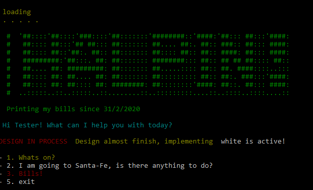
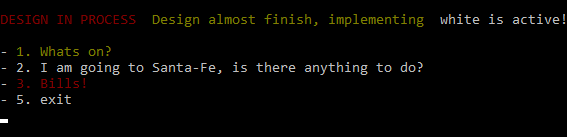
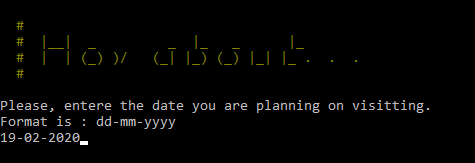

[![Contributors][contributors-shield]][contributors-url]
[![Issues][issues-shield]][issues-url]
<br />
<p align="center">
  
  <h2 align="center"> ✋Halpin Hand ✋</h2>
  <p align="center">
  	Capston project (Ruby ♦️)
    <br />
    <a href="https://github.com/Fig77/Halpin-hand"><strong>Explore the docs »</strong></a>
    <br />
</p>


<!-- ABOUT THE PROJECT -->
## About The Project 
Halpin is a web scraper that will perform a set of different tasks, regarding gathering data. The end product should be able to release my monthly routine of some mundane tasks, involving around printing bills/checking said bills status (Deployment with this feature is not on this demo). Made with Ruby♦️

<!-- TABLE OF CONTENTS -->
## Table of Contents
* [Built With](#built-with)
* [Installation](#how-to-play)
  * [Requirements](#perquisites)
* [How to Use](#instructions)
	* [Events by date](#Santa-fe-events-by-date)
* [Testing](#testing)
* [Future Improvments](#future-improvments)
* [License](#license)
* [Contact](#contact)

## Built with

* Nokogiri
* Mechanize
* Colorize
* RSpec

## Installation

### Prerequisites
 The development environment uses `Ruby`, hence install ruby before proceeding.
  - Mac OS - `brew install ruby`
  - Linux - `sudo apt-get install ruby-full`
  - Windows - Download RubyInstaller [here](https://rubyinstaller.org/), run it, and you are done!

-----

1. You can download the zip project clicking [here](https://github.com/Fig77/Halpin-hand.git) or you can clone the project using the command - git clone <https://github.com/Fig77/Halpin-hand.git> 
2. If you are in windows, just navigate to the Halpin-hand/bin and click on main to start the app. On Linux, navigate with console using [cd command](https://help.ubuntu.com/community/UsingTheTerminal) and then write `ruby bin/main.rb`
3. Run bundle to install extra gems needed to load ( command bundle install on the command line, or install with gem install [name] the gems listed [here](#built-with) that says requires to install ). [Need help with bundle?](https://bundler.io/)

<!-- USAGE EXAMPLES -->

## How to Use

### Instructions

* Once you enter the app, you'll be greeted by the Menu. In there you'll see which functions (of those that appear on-screen) are currently active, what will be next, and what will probably take a bit longer.
<br>

* You can then press the correspondent number, and enter to proceed. Once the task is complete, you'll be returning to this menu.

#### Santa-fe events by date

* Here the app will scrape through Santa-Fe's city website and will get events with start time and location of a given specific date. If no event is found, nothing will be shown. If an invalid date is entered, you'll be returning to the menu.
* After date format is shown, you'll be expected to enter a date with said format.
<br>


## Testing

Testing was done using RSpec. You can run the tests with the following command
```bash

bundle exec rspec

```

<!-- ROADMAP -->

## Future Improvements

* Translation from received data into English

See the [open issues ](https://github.com/Fig77/Halpin-hand/issues) for a list of proposed features (and known issues).

<!-- CONTACT -->
## Contact📱

* Facundo Iglesias - [Github profile](https://github.com/Fig77)
* Email - fig.igle@gmail.com
* LinkedIn - https://linkedin.com/in/figlesias.com

<!-- MARKDOWN LINKS & IMAGES -->
<!-- https://www.markdownguide.org/basic-syntax/#reference-style-links -->
[contributors-shield]: https://img.shields.io/badge/Contributors-1-brightgreen
[contributors-url]: https://github.com/Fig77/Gradients-Project/graphs/contributors
[issues-shield]: https://img.shields.io/badge/issues-0-%2300ff00
[issues-url]: https://github.com/Fig77/Halpin-hand/issues
[product-screenshot]: assets/menu.png
